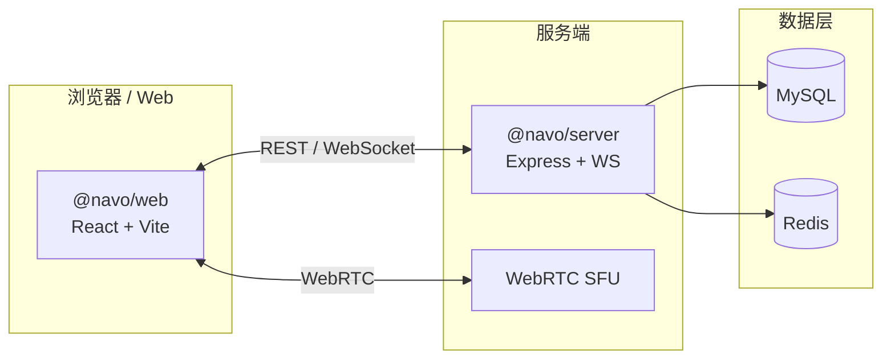

<div align="center">

# Navo IM 专业版

**开源即时通讯 · AI 助手 · 音视频通话 · 端到端加密**

[](https://github.com/aijianai/NavoIM/stargazers)
[](https://github.com/aijianai/NavoIM/network/members)
[](https://github.com/aijianai/NavoIM/watchers)
[](./LICENSE)
[](./CHANGELOG.md)

[](https://navo.airoe.cn)
[](https://www.typescriptlang.org/)
[](https://react.dev/)

如果这个项目对你有帮助，欢迎 **[点一个 Star ⭐](https://github.com/aijianai/NavoIM)** — 你的支持是我们持续更新的动力。

[快速体验](https://navo.airoe.cn) · [功能介绍](#功能一览) · [本地运行](#三步跑起来) · [更新日志](./CHANGELOG.md)

</div>

---

## 项目简介

Navo IM 是一款面向团队与个人的**实时聊天应用**。你可以把它理解成：微信/Discord 的轻量开源替代方案，自带 AI 对话、语音视频和消息加密。

| | |
|---|---|
| **在线演示** | [https://navo.airoe.cn](https://navo.airoe.cn) |
| **源码仓库** | [https://github.com/aijianai/NavoIM](https://github.com/aijianai/NavoIM) |
| **当前版本** | v1.0.0 专业版 |

---

## 仓库数据一览

徽章会随 GitHub 自动更新，无需手动改数字。

| 指标 | 含义 | 链接 |
|:---:|---|---|
| ⭐ **Star** | 觉得项目不错？点 Star 支持一下 | [去 Star](https://github.com/aijianai/NavoIM/stargazers) |
| 🍴 **Fork** | 想二次开发？先 Fork 到自己账号 | [去 Fork](https://github.com/aijianai/NavoIM/fork) |
| 👁 **Watch** | 订阅更新，新版本发布时收到通知 | [去 Watch](https://github.com/aijianai/NavoIM/watchers) |

### Star 增长趋势

点击下方图表可查看完整历史记录。

<p align="center">
  <a href="https://star-history.com/#aijianai/NavoIM&Date">
    <picture>
      <source media="(prefers-color-scheme: dark)" srcset="https://api.star-history.com/svg?repos=aijianai/NavoIM&type=Date&theme=dark" />
      <source media="(prefers-color-scheme: light)" srcset="https://api.star-history.com/svg?repos=aijianai/NavoIM&type=Date" />
      
    </picture>
  </a>
</p>

---

## 功能一览

| 模块 | 一句话说明 |
|---|---|
| 💬 **即时消息** | WebSocket 实时收发，离线后自动补齐未读 |
| 👥 **私聊 / 群聊 / 频道** | 常见 IM 场景都支持 |
| 🤖 **AI 助手** | 接入大模型，会话内直接对话 |
| 📞 **语音 / 视频** | WebRTC + SFU，多人通话 |
| 🔒 **端到端加密** | 敏感会话可选 E2EE |
| 🛠 **管理后台** | 用户、组织、敏感词、推送等运营能力 |
| 🌍 **多语言** | 中文 / English / 日本語 |

---

## 技术架构



| 包 | 目录 | 技术 |
|---|---|---|
| `@navo/shared` | `shared/` | 共享类型与 i18n |
| `@navo/server` | `server/` | Express · WebSocket · MySQL · Redis |
| `@navo/web` | `web/` | React · Vite · Tailwind · Zustand |

---

## 三步跑起来

### 1. 准备环境

需要安装：**Node.js 20+**、**MySQL 8+**、**Redis 6+**

### 2. 克隆并安装

```bash
git clone https://github.com/aijianai/NavoIM.git
cd NavoIM
npm install
cp .env.example .env
```

编辑 `.env`，至少填写这几项：

| 变量 | 填什么 |
|---|---|
| `JWT_SECRET` | 随便一串长随机字符（用于登录令牌） |
| `AI_API_KEY` | 你的 AI 接口密钥 |
| `PUBLIC_BASE_URL` | 网站对外访问地址 |
| `MYSQL_PASSWORD` | 数据库密码 |

### 3. 启动

```bash
# 开发模式（前端 5173 + 后端 8080）
npm run dev

# 或生产构建后启动
npm run build
npm run start
```

> **小提示：** 开发时 Vite 默认把接口代理到 `4000` 端口。若后端跑在 `8080`，请在 `.env` 里设 `PORT=4000`，或改 `web/vite.config.ts` 里的代理地址。

---

## 目录结构

```
NavoIM/
├── shared/       # 前后端共用类型
├── server/       # API、WebSocket、音视频 SFU
├── web/          # 前端界面（含 web/dist 构建产物）
└── CHANGELOG.md  # 版本更新记录
```

---

## 常用命令

| 命令 | 作用 |
|---|---|
| `npm run dev` | 同时启动前后端开发服务 |
| `npm run build` | 构建（顺序：shared → server → web） |
| `npm run typecheck` | TypeScript 类型检查 |
| `npm run start` | 启动生产环境后端 |

---

## 参与与反馈

- ⭐ **Star** — 让更多人看到这个项目
- 👁 **Watch** — 订阅发布通知，不错过新版本
- 🍴 **Fork** — 基于源码做定制或贡献 PR
- 🐛 **Issue** — [提交问题或建议](https://github.com/aijianai/NavoIM/issues)

---

## 许可证

本项目采用 [GPL-3.0](./LICENSE) 许可证。使用、修改与分发请遵守许可条款。

---

<div align="center">

**[⭐ 给 NavoIM 点个 Star](https://github.com/aijianai/NavoIM)** · **[🌐 打开在线演示](https://navo.airoe.cn)**

Made with care by [aijianai](https://github.com/aijianai)

</div>
